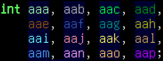

# Rainbow Variables plugin for Neovim
## About
This plugin colors variables and user-defined datatypes based on their name. You can have up to 16 differently-colored variables at a time.

It also adds background colors to variables, indicating whether they're parameters (cyan), local variables (blue), or members of another object (black). 
## Installation
The installation consists of these three steps, if you don't use a plugin manager:
- Make sure you have language servers set up for all languages you want to use this plugin with
- `git clone https://github.com/goldos24/rainbow-variables-nvim.git ~/.local/share/nvim/site/pack/plugins/start/rainbow-variables-nvim`
- add `require 'rainbow-variables-nvim' to your nvim config
