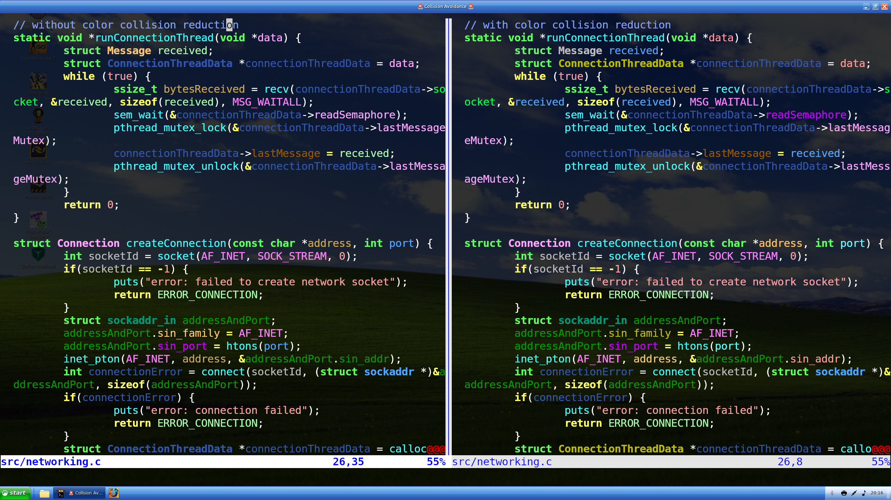
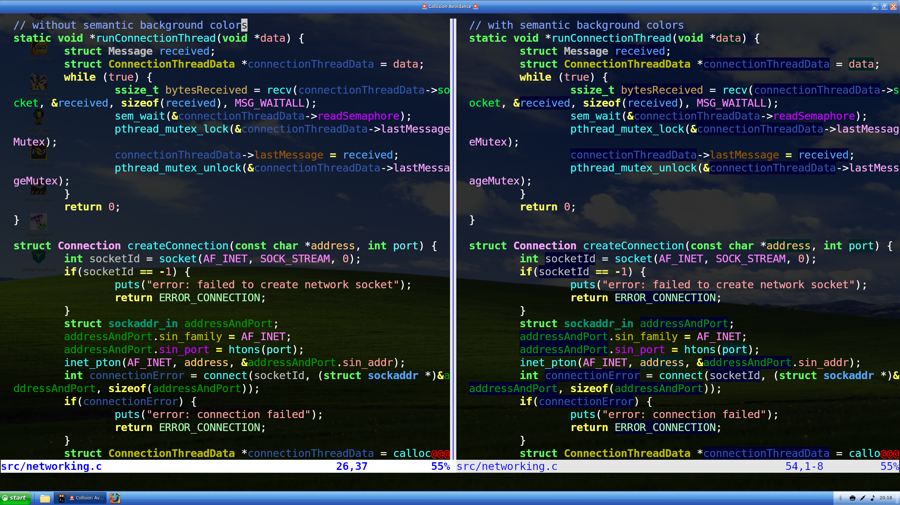

# Rainbow Variables plugin for Neovim
## About
This plugin colors variables and user-defined datatypes based on their name. You can have up to 16 differently-colored variables at a time.


It also adds background colors to variables, indicating whether they're parameters (cyan), local variables (blue), or members of another object (black). 
## Installation
The installation consists of these three steps, if you don't use a plugin manager:
- Make sure you have language servers set up for all languages you want to use this plugin with
- `git clone https://github.com/goldos24/rainbow-variables-nvim.git ~/.local/share/nvim/site/pack/plugins/start/rainbow-variables-nvim`
- add `require('rainbow-variables-nvim').start_with_config({})` to your nvim config for the default configuration
## Configuration
Now this is where the fun begins.
### Color collision reduction
```lua
require('rainbow-variables-nvim').start_with_config({reduce_color_collisions = true})
```
With the default configuration of the plugin, the only thing deciding a variable's color is its hash value. However, it isn't uncommon to see multiple variables with the same hash value. Therefore, you can activate a slightly different strategy that attempts to distribute colors more uniformly.

### Semantic background colors
```lua
require('rainbow-variables-nvim').start_with_config({semantic_background_colors = false})
```
This feature is activated by default. It colors the background of parameters in a dark cyan, the background of members black, and the background of normal variables blue. If you don't want to use this feature, you can deactivate it.

### Scope Shadowing
```lua
require('rainbow-variables-nvim').start_with_config({semantic_background_colors = 'members'})
require('rainbow-variables-nvim').start_with_config({semantic_background_colors = 'multilevel'})
```
This is currently WIP. 
